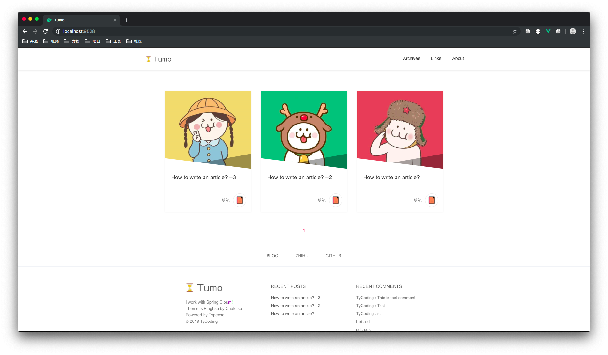
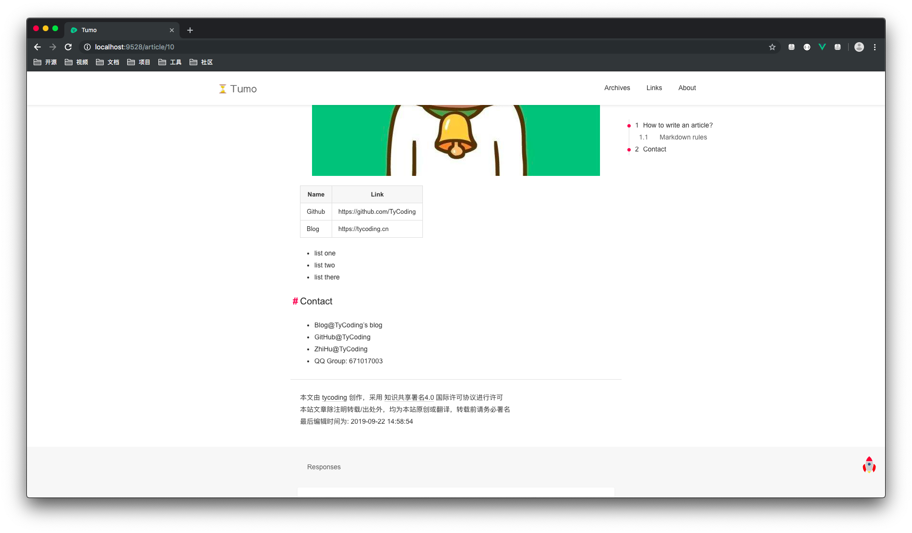
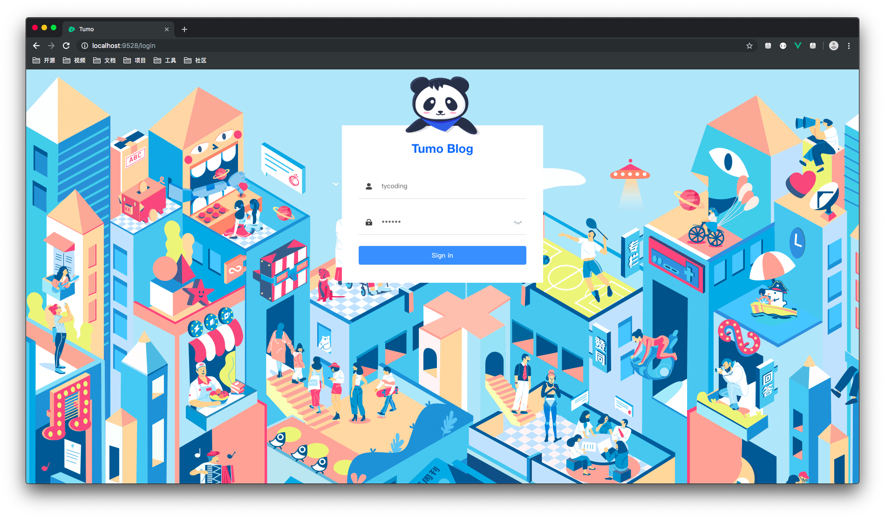
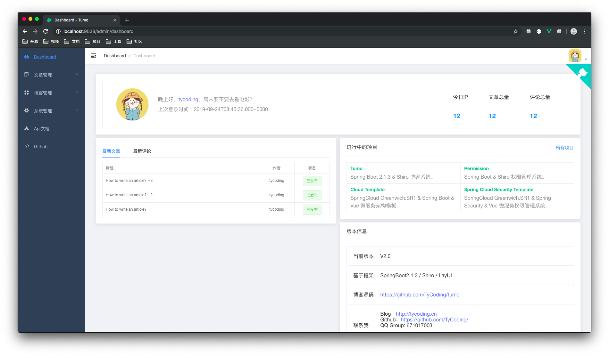
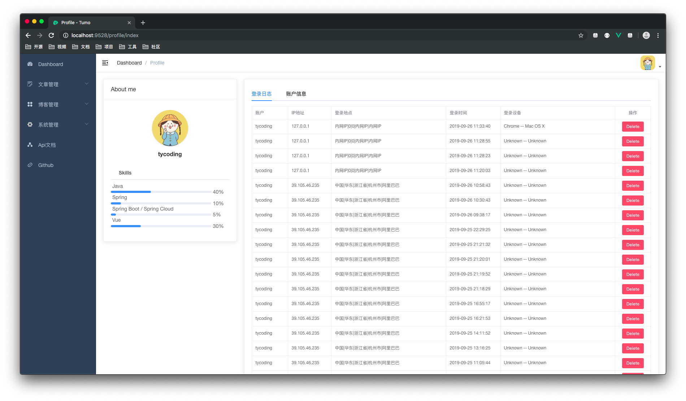
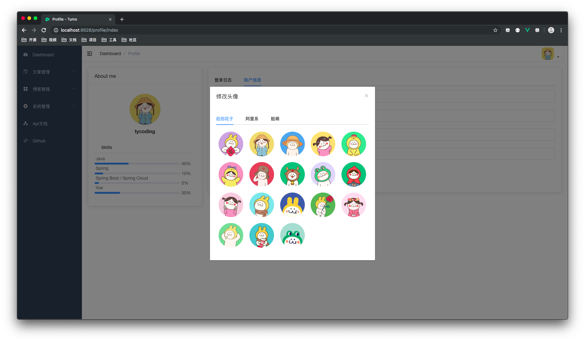
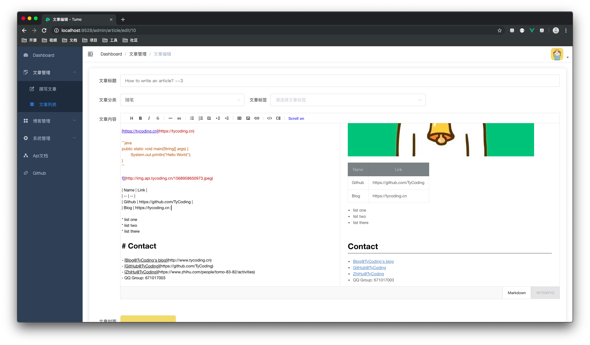
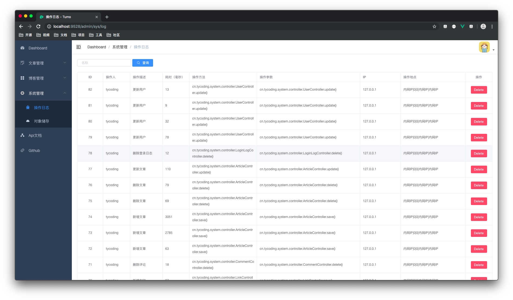
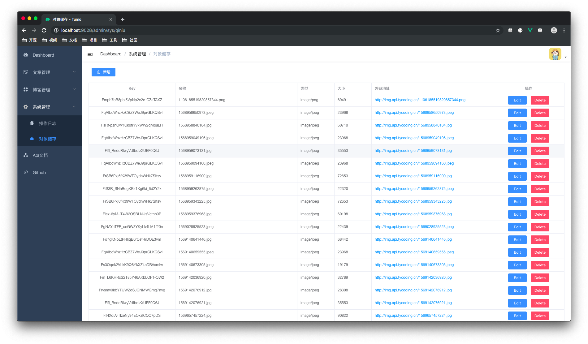
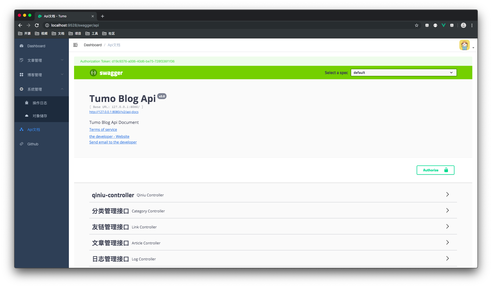

# Tumo Blog 

Tumo Blog -Vue，是 [Tumo](https://github.com/TyCoding/tumo) 项目的Vue版本，采用了SpringBoot2.1.3 + Vue前后端分离式开发。项目集成了Shiro、Swagger等框架，对于初学Vue前后端分离项目的朋友来说，这是个不错的例子。

SpringBoot + LayUI 前后端不分离版本：[Tumo](https://github.com/TyCoding/tumo)

如果大家喜欢、或是对大家的学习有所帮助，请点击右上角star、fork 给作者一些鼓励。

## 写在前面

学习了此项目，能带给你：

1. 了解在基于Vue的前后端分离项目中如果完成CRUD和数据交互
2. 学习在基于Vue的前后端分离项目中如何使用Shiro进行权限控制
3. 清楚一个前后端分离博客项目的开发流程和设计思路
4. 总而言之，这是一个不错的前后端分离项目示例，通俗易懂的代码设计和业务流程，带给你更愉快的开发体验。

## 运行

此仓库实际包含两个项目：

- `api` - 博客Java后端接口（SpringBoot）
- `app` - 博客前前端页面（Vue）

请分别运行这两个项目：

- `api` - 运行`TumoApplication.java`的main方法即可
- `app` - 使用`npm run dev`运行前端vue项目

## 联系我

- [Blog@TyCoding's blog](http://www.tycoding.cn)

- [GitHub@TyCoding](https://github.com/TyCoding)

- [ZhiHu@TyCoding](https://www.zhihu.com/people/tomo-83-82/activities)

- QQ Group: 671017003

## 项目预览

在GitHub页面上修改并提交
